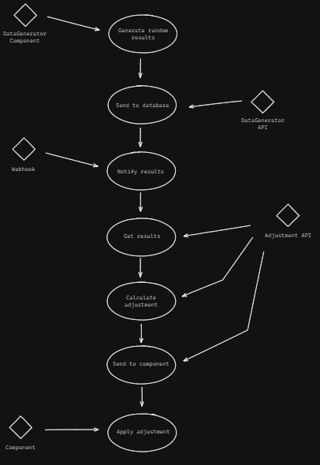

# MachineSense

1. A new ResultData is generated.
2. The ResultData is saved on database.
3. The webhook is triggered and sends the result to the Adjustment_API.
5. The Adjustment_API sends calculated adjustment values for the Adjustment_Component if needed.
6. The Adjustment_Component accesses the machine DAT file and applies the necessary adjusted values in the file.
7. The DAT file is updated and the machine uses the new parameters set in the next machining.

# Use Case Diagram

